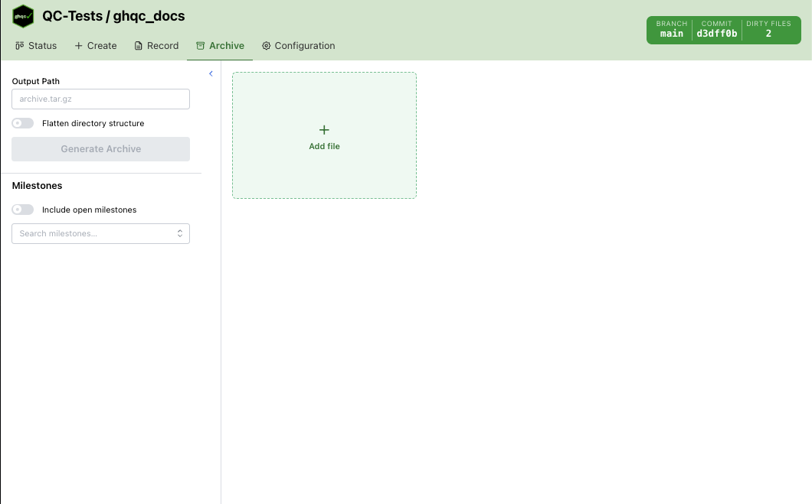
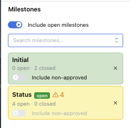
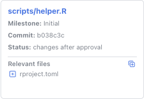
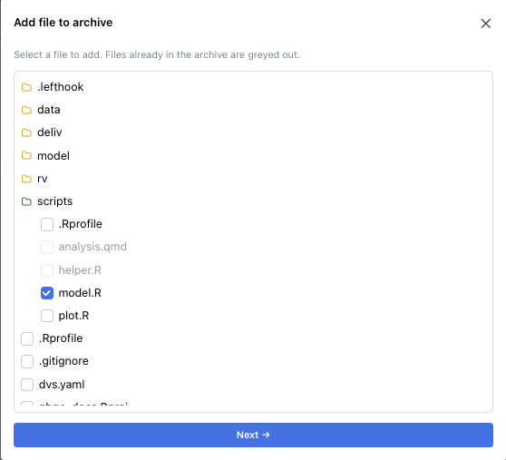
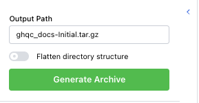

import { Card } from '@astrojs/starlight/components';

import archiveWithIssues from '../../../assets/features/archive/with_issues.png';
import archiveNonApproved from '../../../assets/features/archive/non_approved.png';
import archiveAddFileIssue from '../../../assets/features/archive/add_file_issue.png';
import archiveAddFileCommit from '../../../assets/features/archive/add_file_commit.png';
import archiveGenerateSection from '../../../assets/features/archive/generate_section.png';

The Archive tab creates a `.tar.gz` bundle for one or more milestones. It builds the archive from the QC files associated with the selected milestone issues,
then allows manually adding and resolving additional files before generating the final archive.

## Layout

The Archive tab has two main areas:

- **Left sidebar** — select milestones, configure archive options, and generate the archive
- **Main panel** — displays all files which will be included in the archive

The main panel always begins with an **Add file** card, which can be used to manually add repository files. The remaining cards represent
files pulled from the selected milestones or files which have been manually added and resolved.



## Milestones
The milestone picker is a searchable multi-select dropdown.

By default, only **closed** milestones are shown. Turning on **Include open milestones** also exposes open milestones in the dropdown.

Each selected milestone becomes a status card showing:
<div style={{ display: 'flex', alignItems: 'center'}}>
  <div style={{ flex: 1 }}>
    - milestone name
    - open and closed issue counts
    - whether the milestone is still open
    - whether issue-status loading is still in progress
    - warnings or errors that affect record generation
  </div>
  <div style={{ flex: 0.75 }}>  </div>
</div>


### Milestone Card States

Selected milestone cards use color and icons to communicate status:

- **Green** — issue data loaded successfully
- **Yellow** — one or more issues in the milestone are not approved
- **Red** — issue listing failed, or one or more issue status fetches failed

An open milestone also shows an indicator explaining that the archive may be incomplete.

### Include Non-Approved

If a milestone contains unapproved issues, its card includes an **Include non-approved** toggle.

- **Off** — only approved milestone issues are included
- **On** — approved and non-approved issues from that milestone are included

This toggle is disabled if enabling it would create file conflicts with the other selected milestones.

## Archive File Panel

The main panel shows one card per visible archive file.

<div style="display: flex; justify-content: center;">
  
</div>

### Milestone Issue Cards

Each visible milestone issue card shows:

<div style={{ display: 'flex', alignItems: 'center'}}>
  <div style={{ flex: 1 }}>
    - file path, linking to the GitHub issue
    - milestone name
    - the commit that will be archived
    - the QC status
    - relevant files attached to that issue
  </div>
  <div style={{ flex: 0.75 }}>
    
  </div>
</div>

For milestone issue files, the archived commit is the approved commit when one exists; otherwise it falls back to the latest commit.

### Relevant Files

Issue cards can expose a **Relevant files** section.

From that section you can:

- add a single relevant file to the archive
- add all unclaimed relevant files at once

Relevant files that are already present in the archive are greyed out and cannot be added again.

### Including Non-Approved Issues

If **Include non-approved** is enabled for a milestone, issue cards for non-approved files are also shown in the archive panel.
These cards show a warning icon but are treated the same as other archive files when generating the archive.

<div style="display: flex; justify-content: center;">
  
</div>

## Manually Added Files

<div style={{ display: 'flex', alignItems: 'center', gap: '1rem' }}>
  <div style={{ flex: 1 }}>
    Clicking **Add file** opens a modal for adding any repository file to the archive.

    First, select the file to include in the archive, then [resolve the file commit](#resolving-a-file).

    Files already present in the archive are greyed out in the picker and cannot be added again.
  </div>
  <div style={{ flex: 0.75 }}>
    
  </div>
</div>

## Resolving a File

Every manually added file or relevant file not associated with an issue must resolve to a specific commit before archive generation.

Unresolved files appear as yellow cards with **Commit not yet selected** labels. These block archive generation until resolved.
Resolved files appear as regular cards, showing the selected commit or issue information.

There are options:

#### Commit Selection
Resolve the file by selecting a commit from which the file content should be included.

If a relevant file is added that is not tied to an issue, can select either a commit OR an issue.

<div style="display: flex; justify-content: center;">
  
</div>

#### Issue Selection
Resolve the file from an issue. The archive uses that issue's approved commit or latest commit.

If a relevant file is added that is tied to an issue, the file is automatically back by the issue.

Files added from QC issues can also expose their own relevant files, which allows building out the archive from issue relationships.

<div style="display: flex; justify-content: center;">
  
</div>

## Output Path

The output path is auto-filled from the repository name and the milestones that currently contribute visible files.

<div style={{ display: 'flex', gap: '0.75rem' }}>
  <div style={{ flex: 1 }}>
    The default filename is:
    ```
    <repo-name>-<milestone-names>.tar.gz
    ```

    If you manually edit the field, it becomes custom and shows a reset button to restore the default name.
  </div>
  <div style={{ flex: 0.75 }}>
    
  </div>
</div>

## Flatten Directory Structure

The sidebar includes a **Flatten directory structure** switch.

- **Off** — preserve repository paths inside the archive
- **On** — place all archived files at the archive root using only their basenames

Flattening is allowed only when no two included files would share the same basename.

If basename collisions exist:

- the flatten switch is disabled
- hovering it shows the colliding filenames

When flattening is enabled, basename-based claiming rules apply across the UI:

- milestone selection can block new milestones that would collide by basename
- relevant files with colliding basenames are greyed out
- files in the add-file modal with colliding basenames are greyed out

## Generate Behavior

The **Generate Archive** button is disabled until all of the following are true:

- at least one file is visible in the archive panel
- the output path is non-empty
- milestone status loading is complete
- every manually added plain file has been resolved to a commit

Clicking **Generate Archive** writes the archive using:

- all visible milestone issue files
- all resolved manually added files
- the current flatten setting

After generation, the tab shows either:

- a green success alert with the written archive path
- a red error alert if archive generation fails
