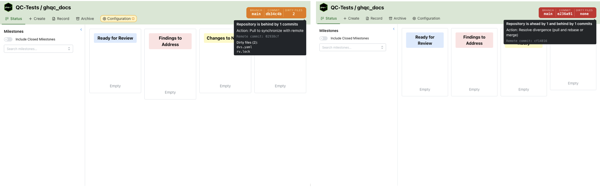
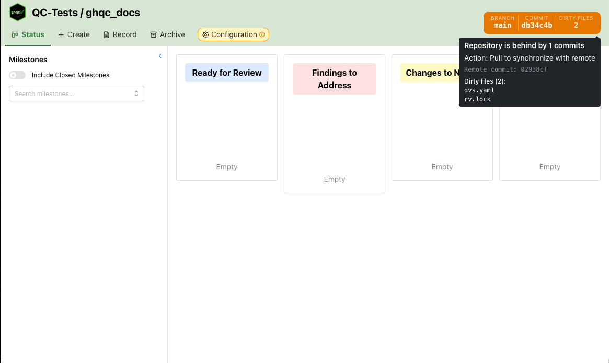
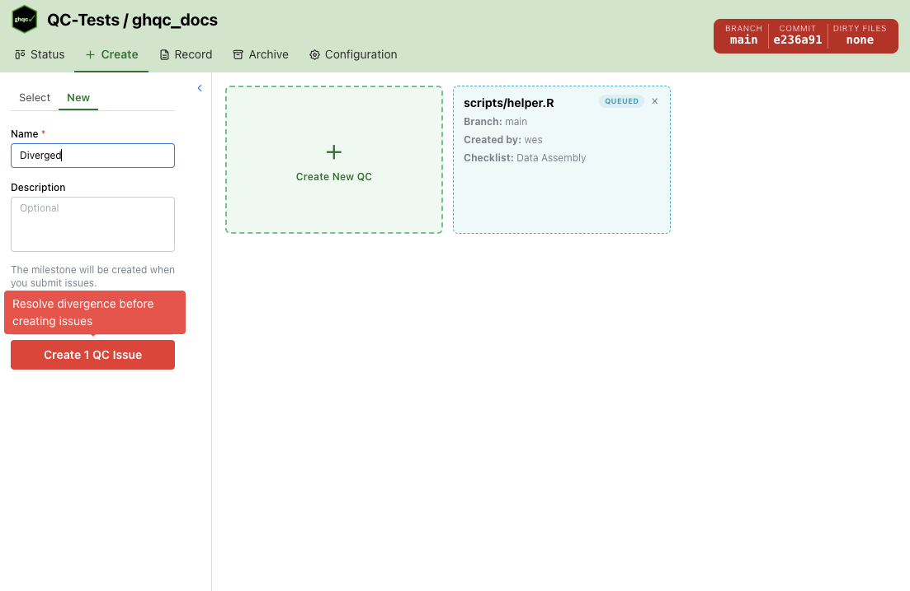

import { Badge } from '@astrojs/starlight/components';

The Git Status pill is always visible in the upper-right corner of the `ghqc` UI. 
It reflects the sync state of your local repository relative to its remote, and updates automatically as you work.

## What It Shows

The pill displays three pieces of information at a glance:

- **Branch name** — the currently checked-out branch
- **Commit SHA** — the first 7 characters of the local HEAD commit
- **Dirty file count** — the number of uncommitted local changes, or "none" if the working tree is clean

## States

The pill color reflects the sync relationship between your local branch and the remote.

| State | Color | Meaning |
|---|---|---|
| `clean` | <Badge text="Green" variant="success"/> | Local and remote are in sync |
| `ahead` | <Badge text="Orange" variant="caution"/> | Local commits exist that have not been pushed |
| `behind` | <Badge text="Orange" variant="caution"/> | Remote commits exist that have not been pulled |
| `diverged` | <Badge text="Read" variant="danger"/> | Local and remote have diverged and cannot be fast-forwarded |

## Tooltip

Hovering over the pill expands a tooltip with additional detail:

- A plain-language description of the current git state
- A recommended action (push, pull, or resolve divergence)
- The remote HEAD commit SHA (when not clean)
- A list of dirty files, if any, up to the first 8 — with a count of any remaining

## Refresh Behavior

The pill polls the `/api/repo` endpoint every **30 seconds** while you are active. If no mouse, keyboard, scroll, or touch input is detected for **5 minutes**, polling pauses. It resumes on the next interaction, and also refetches whenever the browser window regains focus.

## Impact on Create

The git status affects the Create tab. When the repository is not clean, warnings appear above the issue creation form:

- **Diverged** — A red warning blocks creation. Resolve the divergence before creating issues.
- **Ahead or behind** — An orange warning recommends pushing or pulling to synchronize with the remote before creating issues.
- **Dirty files** — A yellow notice recommends committing or stashing local changes before creating issues.

