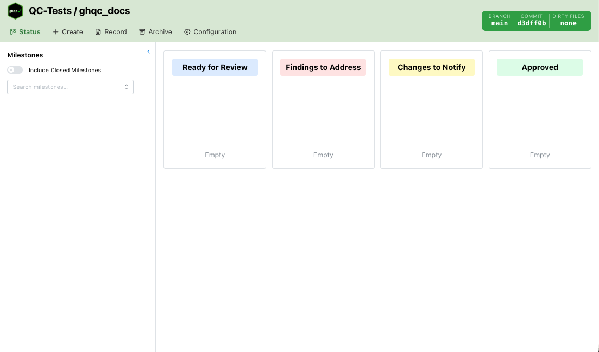
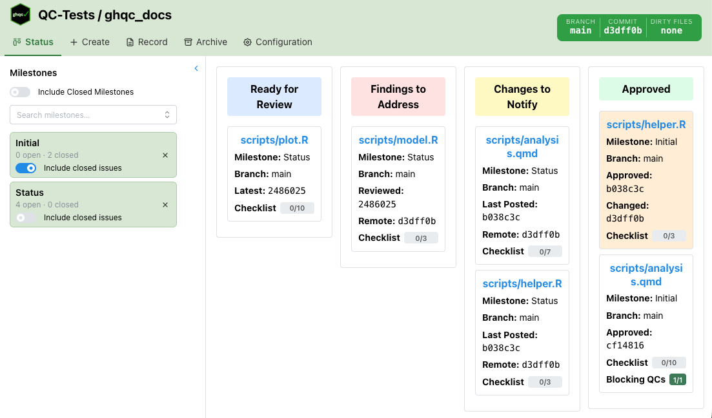

import { Badge, Card, CardGrid } from '@astrojs/starlight/components';

The Status tab displays all QC issues for the selected milestone as a swimlane board. Issues are automatically sorted into one of four 
lanes based on their current QC state, giving a quick visual overview of where every file stands in the review workflow.

## Issue Cards

Each card in the board shows key information about the issue at a glance.

- **File name** — links directly to the GitHub issue
- **Milestone** — the milestone the issue belongs to
- **Branch** — the branch the issue is tracked against; dimmed and shown in red if it differs from the current branch
- **Commit info** — varies by lane:
  - *Ready for Review*: the latest commit SHA
  - *Findings to Address*: the reviewed commit SHA and the remote HEAD
  - *Changes to Notify*: the last posted commit SHA and the remote HEAD
  - *Approved*: the approved commit SHA, and the post-approval change commit if one exists
- **Checklist progress** — a progress bar showing completed checklist items, if the issue has a checklist
- **Blocking QC progress** — a progress bar showing approved blocking QCs, if any are configured
- **Dirty indicator** — a red asterisk in the top-right corner if the file has uncommitted local changes

Clicking a card opens a detail panel with the full issue history and allows [commenting.](../comments)

## Lanes

The board has four lanes. Each lane groups issues that require the same type of attention.

<CardGrid>
<Card title = "Ready for Review" icon = "pen">
Issues where the reviewer is expected to review and either provide feedback or approve.

##### Included QC States:
- **Awaiting review** - the author has commented on the latest file version and the reviewer has not yet reviewed
- **Approval required** - the issue was closed without an approval

##### Default Comment Action
- `Review` if file is dirty
- `Approve` if file is clean
</Card>

<Card title = "Findings to Address" icon = "warning">
Issues where the reviewer has submitted feedback on the last file version and is waiting for the author to respond.

##### Included QC State:
- **Changes requested** - the reviewer has reviewed and requested changes

##### Default Comment Action
- `Notify`
</Card>

<Card title = "Changes to Notify" icon = "comment-alt">
Issues for which the file has changed since the last notification.

##### Included QC States:
- **Changes to comment** - the file has changed since the last notification; a new notification is needed
- **In progress** - issue is open but no reviewer notification has been sent yet

##### Default Comment Action
- `Notify`
</Card>

<Card title = "Approved" icon = "approve-check-circle">
Issues that have received a formal approval.

##### Included QC States:
- **Approved** - the file is approved and has not changed since
- **Approved; subsequent file changes** - the file was approved but has since been modified (card highlighted in orange)

##### Default Comment Action
- `Unapprove`
</Card>
</CardGrid>

