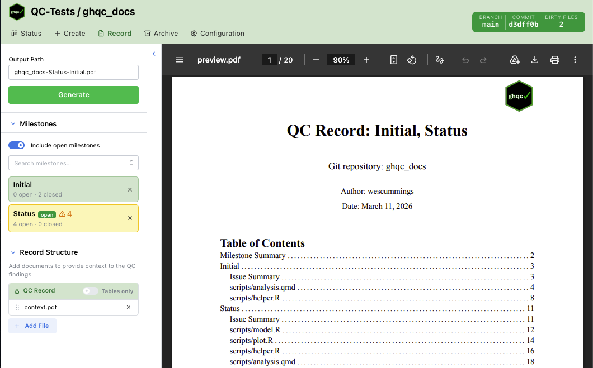

The Record tab generates a PDF QC record for one or more milestones. It is designed for assembling the final review package: selecting milestones, optionally adding context PDFs, previewing the result, and writing the finished file to disk.

This page documents the UI behavior of the Record tab rather than the CLI command.

## Layout

The Record tab is split into two areas:

- **Left sidebar** — output settings, milestone selection, and record structure
- **Right preview pane** — a live PDF preview of the generated record

The sidebar has three sections:

- **Output Path** — where the generated PDF will be written
- **Milestones** — which milestones to include
- **Record Structure** — optional context PDFs to prepend or append around the QC record

Both the **Milestones** and **Record Structure** sections can be collapsed. The divider between sections can also be dragged to resize them.

### Output Path

The output path is auto-filled once at least one valid milestone is selected.

The default filename is:

`<repo-name>-<milestone-names>.pdf`

Spaces in milestone names are converted to hyphens. If **Tables only** is enabled, `-tables` is appended before `.pdf`.

If you manually edit the output path, the field becomes custom. A reset button appears so you can restore the default generated filename.

### Milestones

The milestone picker is a searchable multi-select dropdown.

By default, only **closed** milestones are shown. Turning on **Include open milestones** also exposes open milestones in the dropdown.

Each selected milestone becomes a status card showing:

- milestone name
- open and closed issue counts
- whether the milestone is still open
- whether issue-status loading is still in progress
- warnings or errors that affect record generation

#### Milestone Card States

Selected milestone cards use color and icons to communicate status:

- **Green** — all issue statuses loaded successfully
- **Yellow** — one or more issues in the milestone are not approved
- **Red** — issue listing failed, or one or more issue status fetches failed

An open milestone also shows an indicator explaining that the record may be incomplete.

### Inclusion Rules

Milestones with **red** error states are excluded from both the preview and the generated output.

Milestones with **yellow** warnings are still included. The warning is informational: it tells you that the record includes issues that are not yet approved.

If all selected milestones fail, the preview pane shows an error instead of a PDF.

### Record Structure

The Record Structure section defines the order of PDFs in the final output.

It always contains a fixed **QC Record** row. This row cannot be removed or dragged.

You can add extra PDF files around it to provide context, such as:

- a cover page
- an appendix
- supplemental documentation

Files placed **above** the QC Record are prepended. Files placed **below** it are appended.

Added files can be:

- reordered by drag and drop
- removed individually

#### Tables Only

The fixed **QC Record** row contains the **Tables only** switch.

- **Off** — generate the full QC record, including detailed QC history
- **On** — generate only the QC summary tables

Changing this switch updates both the preview request and the default output filename.

#### Adding Context Files

Click **Add File** to open the context-file modal.

The modal has two tabs:

- **Browse Server** — pick an existing PDF from the repository file tree
- **Upload** — upload a PDF from your local machine for temporary server-side use

Only PDF files are selectable. After a file is added, it appears in the Record Structure list and can be reordered relative to the QC Record.

Generating a record refreshes the file tree used by this modal, so newly generated PDFs can be selected as context files afterward.

## Preview Behavior

The preview pane updates automatically whenever the effective record contents change, including:

- selected milestones
- milestone status resolution
- the **Tables only** setting
- context-file ordering
- added or removed context files

If a preview is already visible and a new preview is being generated, the tab shows a loading overlay on top of the existing PDF.

If preview generation fails, the pane shows the error and a **Retry** button.

Before any milestone is selected, the pane shows a placeholder message prompting you to select a milestone.

## Generate Behavior

The **Generate** button is disabled until:

- at least one milestone is selected
- the output path is non-empty

After generation, the tab shows either:

- a green success alert with the final path
- a red error alert if generation fails

Clicking **Generate** writes the PDF to the output path using:

- all selected milestones that do not have red error states
- the current **Tables only** setting
- the current ordered list of context PDFs

The generated output matches the same milestone set and ordering model used by the preview.

## Preview

Below is an example record generated by `ghqc`.

<iframe
    src = "/ghqc-docs/new_record.pdf"
    style="width: 100%; height: 85vh; border: none;"
></iframe>
