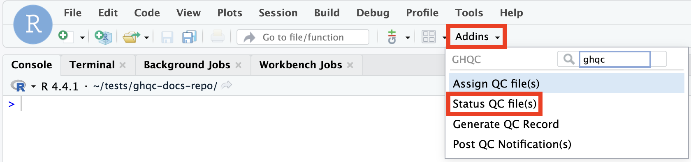
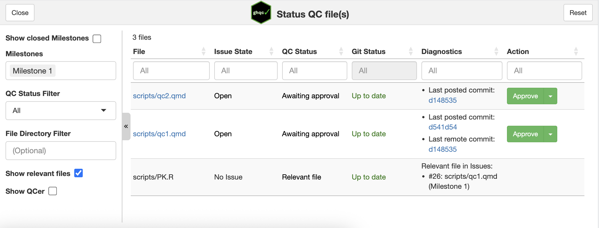
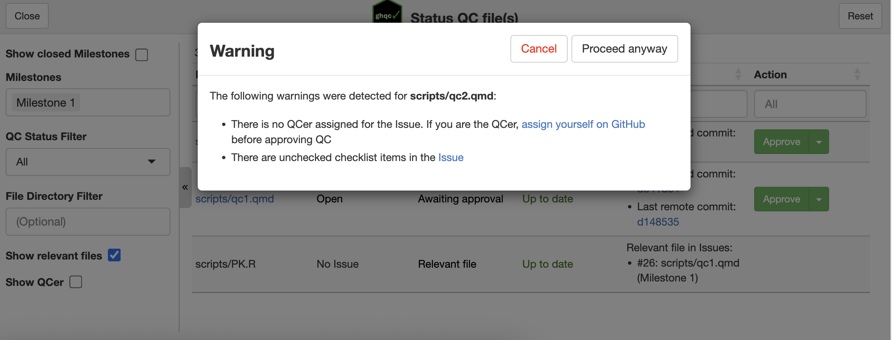
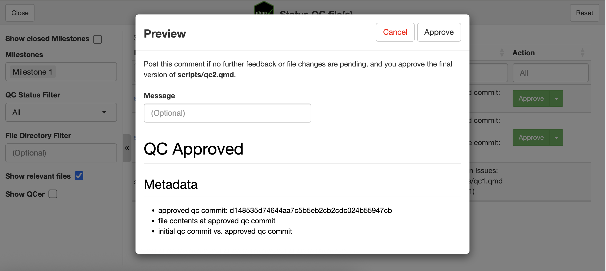
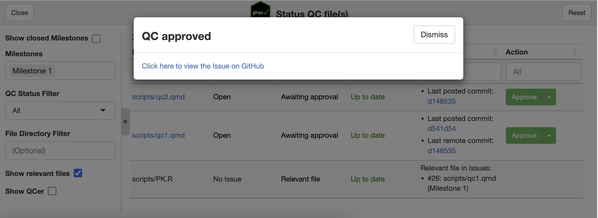
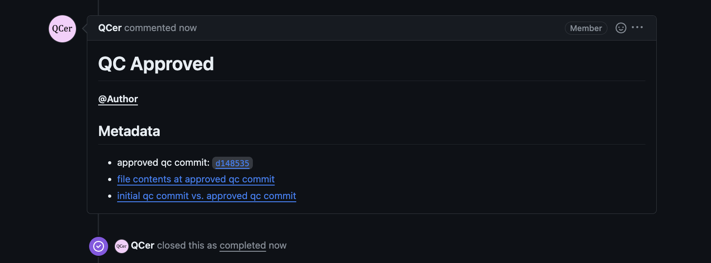

import { Tabs, TabItem, Card, CardGrid } from '@astrojs/starlight/components';

As discussed in the [introduction](../introduction), `ghqc` utilizes a 3 phase approach. On this page we will work through the third phase, 
**Approve**, and approve our first QCed file.

As a way to help users see the *status* of their project, `ghqc` includes the Status App. This helps users know if files have been
changed since the last time the Issue had a notification and streamline creating that notification. Additionally, when a file's last change
has been notified, the Status App allows the user to *approve* the change. 

### 1. Launch the Status App

We will launch the app in one of two ways:

<Tabs syncKey="addins">
    <TabItem label = "via Console">
        ```r
        library(ghqc)
        ghqc_status_app()
        ```
    </TabItem>
    <TabItem label = "via RStudio Addin">
        :::note
            `miniUI` must be installed in your project to use RStudio Addins.
            <Tabs syncKey="rv">
                <TabItem label = "R">
                    ```r
                    install.packages("miniUI") 
                    ```
                </TabItem>
                <TabItem label = "rv">
                    <CardGrid>
                        <Card title = "Shell Command">
                        ```
                        rv add miniUI
                        ```
                        </Card>
                        <Card title= "R Console">
                        ```r
                        .rv$add("miniUI")
                        ```
                        </Card>
                    </CardGrid>
                </TabItem>
            </Tabs>
        :::

        Using the `Addins` dropdown in the RStudio navigation bar, search for `ghqc`, then select "Post QC Notification(s)".

        
    </TabItem>
</Tabs>

The app will then launch in your viewer panel.

### 2. Configure Issue Approval

When the status app opens, you will see many options on the left, including the milestone we created on 
[Initialize Page](../initialize/#2-create-a-new-milestone) present in the **Milestones** input box. 

Additionally, all files related to the milestone, including files that are relevant files of an Issue,
will be rendered on the right side. Each state, status, and action will be different depending on the state of the file.

Since we have notified the latest change for our issues, we see the **Approve** button in green. 



If anything is not in an ideal state for the issue, a pop-up will appear informing you what could be improved. In our example,
since we have no QCer and did not complete the checklist, we will see two warnings in our pop-up.



We will **Proceed anyway** and see another pop-up. This time you are able to provide a message and 
preview the closing comment body. 



### 3. Post Approval

Once you are ready to approve, click the **Approve** button in the top right. Similarly to our other two apps,
as success message will appear with a link to view the newly posted approval.



### 4. QC Approval Body

Upon approval of the issue, `ghqc` will create a comment like the [Notify App](../review/#5-qc-notification-body),
but contains the approved qc commit and links to the file content at the commit and a difference between when the QC was initialized
and its approved state.

Additionally, after the comment is posted, the issue is closed, marking that the QC for the file has been completed.



