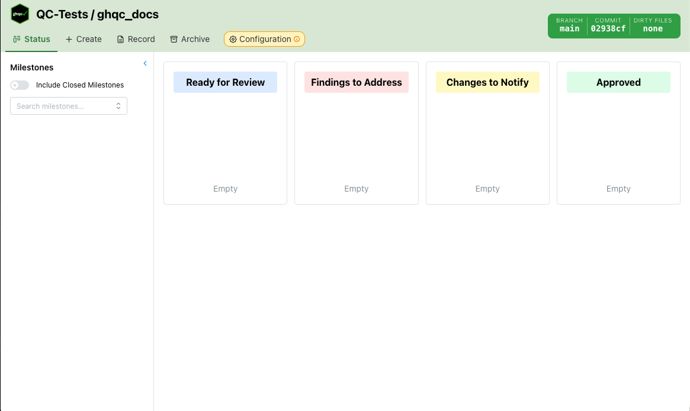

import { Tabs, TabItem } from '@astrojs/starlight/components';

import gitBehind from '../../../../assets/intro/getting-started/git-behind.png';

import configSettingUp from '../../../../assets/intro/getting-started/config-setting-up.png';
import configSetUp from '../../../../assets/intro/getting-started/config-set-up.png';

This section will walk through how to start using `ghqc` with a minimal example where we:
* [Create a QC](./create)
* [See the QC Status](./status)
* [Post a review](./review)
* [Address the review notify our changes](./findings)
* [Approve the QC](./approve)

But first, we will walk through starting `ghqc` and review the first 2 features.

:::caution
To follow along in your own project, please ensure:
* The [installation instructions](../installation) have been completed
* You are in the project root of a project with a GitHub git remote
:::

## Starting ghqc

Use one of the following to launch the user interface

<Tabs>
    <TabItem label = "Terminal">
        This will open the user interface into a tab in your browser
        ```bash
        ghqc ui
        ```
    </TabItem>
    <TabItem label = "R">
        This will open the user interface into the viewer panel of RStudio or Positron
        ```r
        ghqc::ghqc()
        ```
    </TabItem>
</Tabs>

Once the server starts and the user interface opens, an interface will open similar to the following.



## Git Status
The first feature of this initial page is the git status box in the upper right hand corner.
When the project is up to date with the remote, the status is green. If it is ahead, behind, or diverged the status turn yellow/red.

<div style="display: flex; justify-content: center;">
  
</div>

## Configuration
Once the interface is open, the first step is to set-up the configuration. To allow users and groups to configure exactly how they would
like `ghqc` to behave, we encourage the use of a [configuration repository](../configuration).

To set-up the configuration repository for the project, simply insert your group's repository git url and click set-up. For your convenience,
an example repository has been set-up at `https://github.com/a2-ai/ghqc.example_config_repo`.

<div style="display: flex; justify-content: center;">
  
</div>

Once set-up, the configuration tab displays the checklists and options found in the configuration repository.

<div style="display: flex; justify-content: center;">
  
</div>