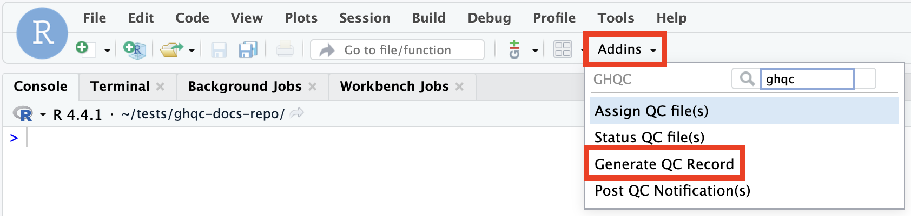
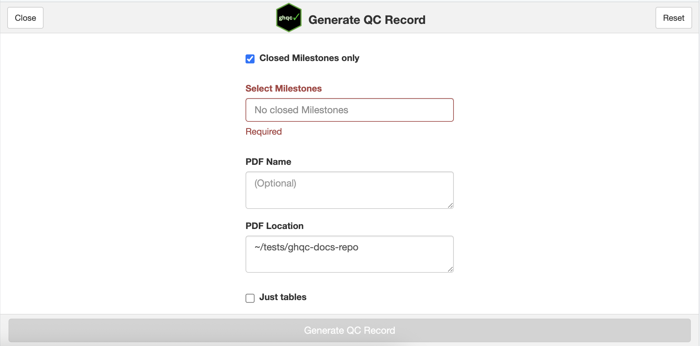
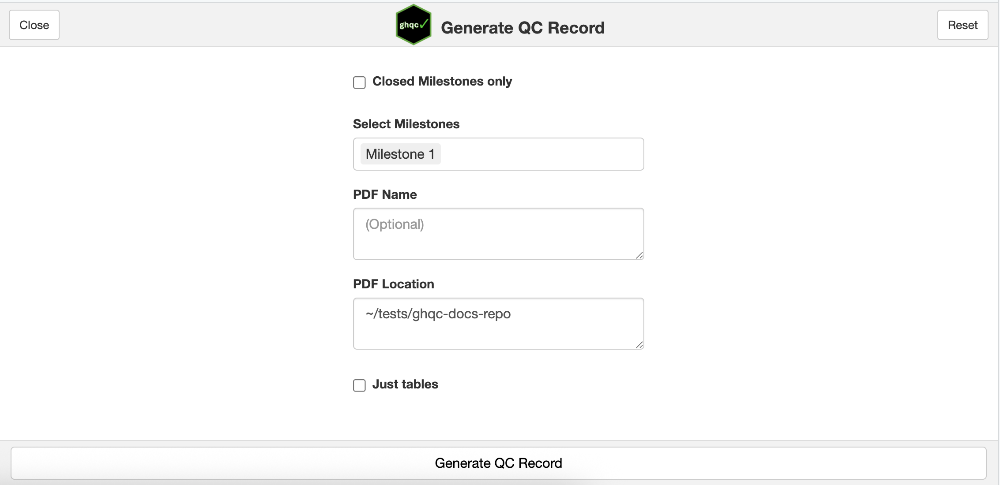
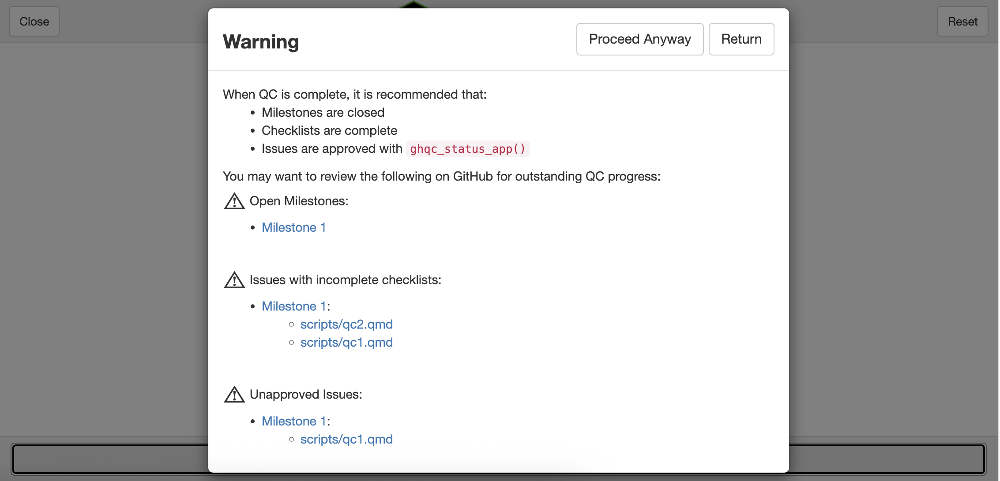
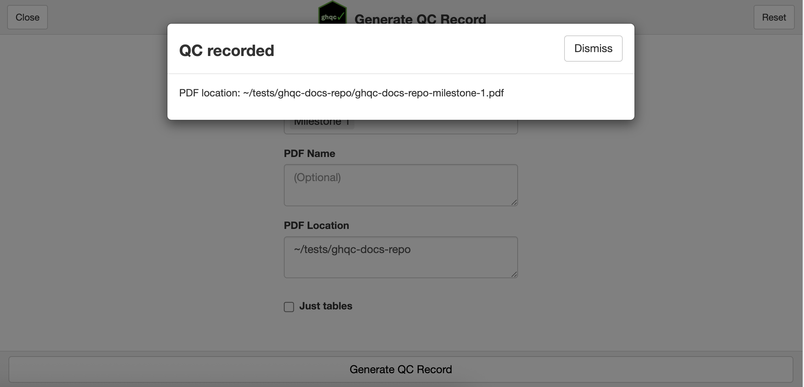

import { Tabs, TabItem, Card, CardGrid } from '@astrojs/starlight/components';

GitHub was chosen as the *hub* for the QC process to centralize the files, changes, and communication between author and reviewer in
one accessible, persistent location. But sometimes, it is necessary to record the QC history into an exportable file.

### 1. Launch the Record App

We will launch the app in one of two ways:

<Tabs syncKey="addins">
    <TabItem label = "via Console">
        ```r
        library(ghqc)
        ghqc_record_app()
        ```
    </TabItem>
    <TabItem label = "via RStudio Addin">
        :::note
            `miniUI` must be installed in your project to use RStudio Addins.
            <Tabs syncKey="rv">
                <TabItem label = "R">
                    ```r
                    install.packages("miniUI") 
                    ```
                </TabItem>
                <TabItem label = "rv">
                    <CardGrid>
                        <Card title = "Shell Command">
                        ```
                        rv add miniUI
                        ```
                        </Card>
                        <Card title= "R Console">
                        ```r
                        .rv$add("miniUI")
                        ```
                        </Card>
                    </CardGrid>
                </TabItem>
            </Tabs>
        :::

        Using the `Addins` dropdown in the RStudio navigation bar, search for `ghqc`, then select "Post QC Notification(s)".

        
    </TabItem>
</Tabs>

The app will then launch in your viewer panel.



### 2. Configure Record

There are 5 ways to configure the QC record:

##### Closed Milestone Only

Records use milestones to collect what should be added to the record. Since a record is typically only created at the end of
a QC, the default is to only include closed milestones as options.

In our example, we only approved the QC of one of our files, and did not close the Milestone, therefore we have to
uncheck the **Closed Milestones only** checkbox.

---

##### Select Milestones
The Record App allows users to create one report for as many milestones as desired. We will select our created *Milestone 1*.

---

##### PDF Name
By default, the pdf name will default to `{repo}-{milestone names}`. 
In this example, we'll leave it as blank and expect our PDF name to be "ghqc-docs-repo-Milestone-1.pdf".

:::note
The pdf name will replace spaces with a `-` in the milestone names. Additionally, if multiple milestones are selected, the
names will be separated by a `-`.
:::

---

##### PDF location
By default, the pdf will be created and saved to the project root. For this example, we will leave this as is.

---

##### Just tables
The record contains summary tables for all selected milestones and for issues in each milestone. 
Additionally, it reads in the issues and their comments and includes that within the report body.

**Just tables** will only include the summary tables and not the issue content.

---

After configuration we have the following set-up:



### 3. Generate QC Record

After selecting **Generate QC Record**, we will have a pop-up warning indicating we have open milestones and incomplete/unapproved issues.



Typically, these should be addressed before continuing to ensure the QC has been completed, but we will **Proceed Anyway**.

The record will then be generated and the path to the rendered record will be provided.



### 4. QC Record Preview

As mentioned in [Just tables](#just-tables), the record contains both summary tables and the content of each issue. 

<iframe
    src = "/ghqc-docs/record.pdf"
    style="width: 100%; height: 85vh; border: none;"
></iframe>

