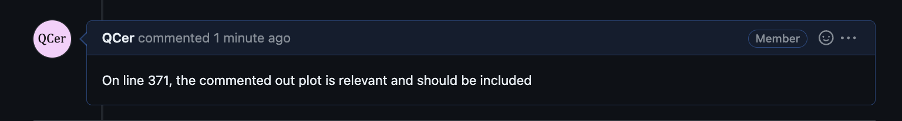
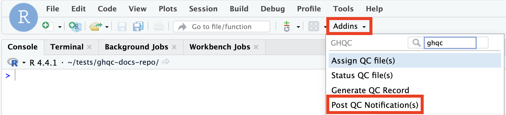
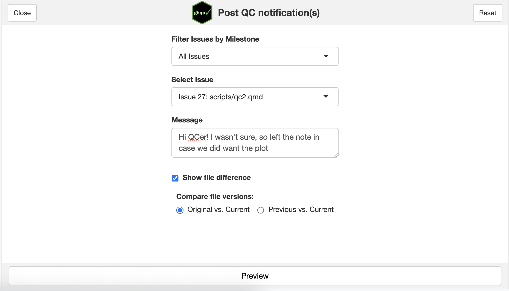
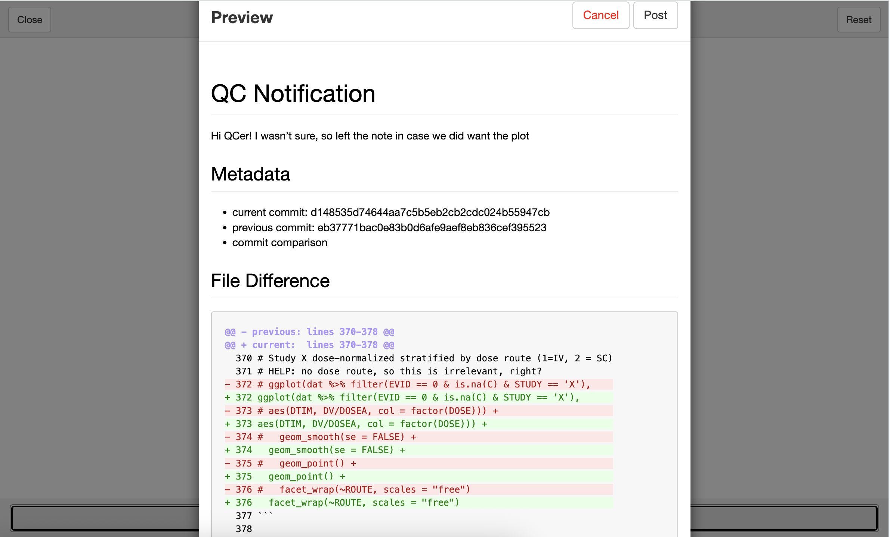
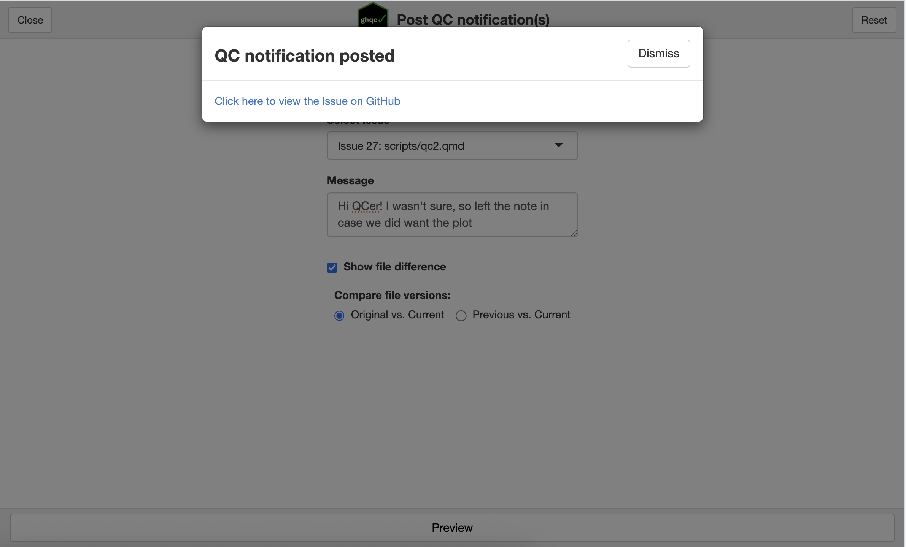
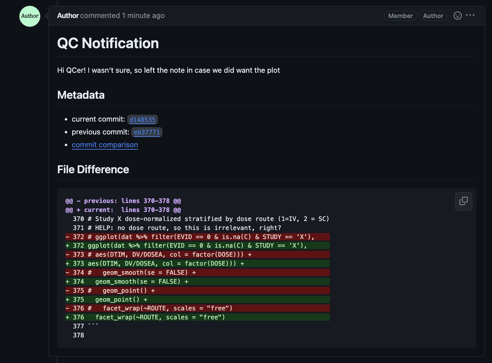

import { Tabs, TabItem, Card, CardGrid } from '@astrojs/starlight/components';

As discussed in the [introduction](../introduction), `ghqc` utilizes a 3 phase approach. On this page we will work through the second phase, 
**Review**, and notify our first file change. The review phase can go back and forth between the reviewer and author as many times as needed
until the file is ready for approval. In this example, we will walk through one iteration loop.

## QCer Review

In a typical workflow, the reviewer will check the repository out to the provided branch and commit provided in the [Issue Body](../initialize/#6-qc-issue-body)
to review the scripts. 

Comments can then be added directly to the GitHub Issue to communicate with the Author.



## Author Response

An author now needs to address the comment(s) made by the QCer. We will make the necessary changes to the files and commit.

After the edits are pushed, we can notify the QCer and include the difference in the file changes using `ghqc` Notify app.

### 1. Launch the Notify App
We will launch the app in one of two ways:
<Tabs syncKey="addins">
    <TabItem label = "via Console">
        ```r
        library(ghqc)
        ghqc_notify_app()
        ```
    </TabItem>
    <TabItem label = "via RStudio Addin">
        :::note
            `miniUI` must be installed in your project to use RStudio Addins.
            <Tabs syncKey="rv">
                <TabItem label = "R">
                    ```r
                    install.packages("miniUI") 
                    ```
                </TabItem>
                <TabItem label = "rv">
                    <CardGrid>
                        <Card title = "Shell Command">
                        ```
                        rv add miniUI
                        ```
                        </Card>
                        <Card title= "R Console">
                        ```r
                        .rv$add("miniUI")
                        ```
                        </Card>
                    </CardGrid>
                </TabItem>
            </Tabs>
        :::

        Using the `Addins` dropdown in the RStudio navigation bar, search for `ghqc`, then select "Post QC Notification(s)".

        
    </TabItem>
</Tabs>

The app will then launch in your viewer panel.

### 2. Configure QC Notification

The notify app allows you to:
* **Filter by Milestone** - By default, all Issues are listed in the Select Issue dropdown. Over the course of projects, it may be beneficial to filter relevant Milestone Issues
* **Select Issue** - Select the issue to notify the reviewer updates
* **Message** - Optionally, include a message to provide additional context
* **Show file difference** - If the file is a text based file, generate a git style difference within the Issue comment.
* **Compare file versions**
    * **Original vs. Current** - By default, ghqc will compare the commit last commented in the Issue thread to the current commit.
    * **Previous vs. Current** - Allows users to select specific commits to compare.



### 3. Preview QC Notification

Once the app is configured how you'd like, selecting the proper issue and commits, `ghqc` allows you to preview to the comment before it is posted.



### 4. Post QC Notification

If you are happy with the content of the notification, click the **Post** button in the top right. 
Similarly to [creating a QC Issue](../initialize/#5-assign-qc-files), a success message will appear with a link to view the newly posted comment.



### 5. QC Notification Body

The QC notification should look the same as it did in the preview, containing metadata of what commits the diff was taken between
and a link to the GitHub commit difference for greater context.


