import { Tabs, TabItem, Card, CardGrid, Badge } from '@astrojs/starlight/components';

As discussed in the [introduction](../introduction), `ghqc` utilizes a 3 phase approach. On this page we will work through the first phase, 
**Initialize**, and create our first ghqc GitHub Issues.

### 1. Launch the Assign App

After the R packages have been installed, there are two ways to launch the app:
<Tabs syncKey="addins">
    <TabItem label = "via Console">
        ```r 
        library(ghqc)
        ghqc_assign_app()
        ```
    </TabItem>
    <TabItem label = "via RStudio Addins">
        :::note
            `miniUI` must be installed in your project to use RStudio Addins.
            <Tabs syncKey="rv">
                <TabItem label = "R">
                    ```r
                    install.packages("miniUI") 
                    ```
                </TabItem>
                <TabItem label = "rv">
                    <CardGrid>
                        <Card title = "Shell Command">
                        ```
                        rv add miniUI
                        ```
                        </Card>
                        <Card title= "R Console">
                        ```r
                        .rv$add("miniUI")
                        ```
                        </Card>
                    </CardGrid>
                </TabItem>
            </Tabs>
        :::

        Using the `Addins` dropdown in the RStudio navigation bar, search for `ghqc`, then select "Assign QC file(s)".

        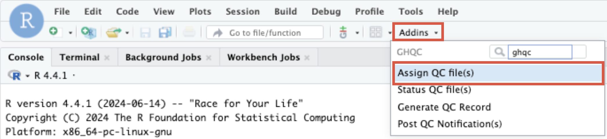
    </TabItem>
</Tabs>

The app will then launch, with the process running as a [background job](https://docs.posit.co/ide/user/ide/guide/tools/jobs.html) 
and the UI in the "Viewer" panel, leaving your R session free to continue working while the app is open in your screen.

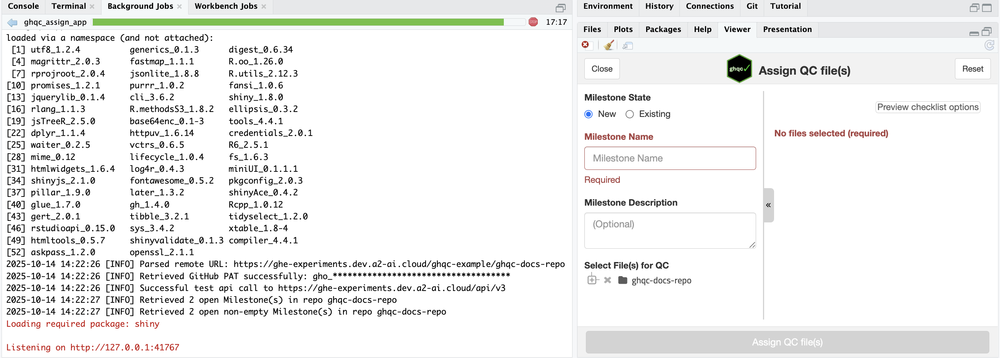

### 2. Create a New Milestone

The first thing we'll do in the app is create a New Milestone. 

In this example, we will name the Milestone "*Milestone 1*" and input the optional description as "*My first ghqc project*".

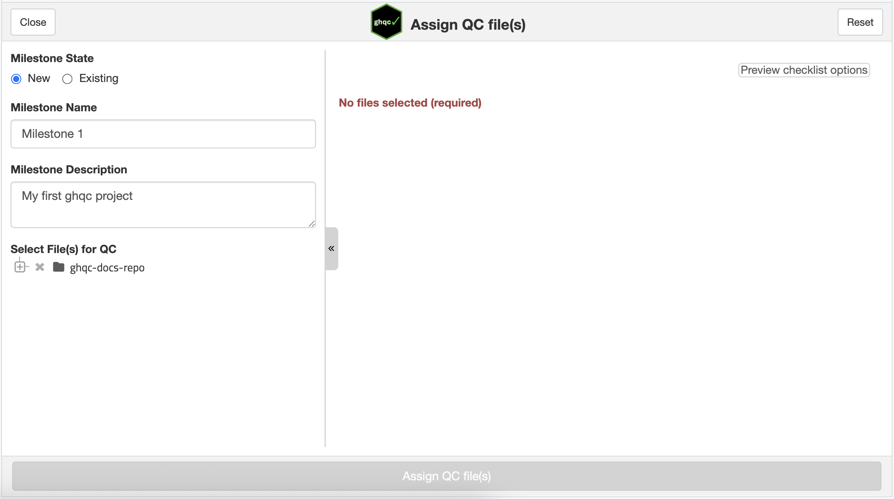

### 3. Select Files for QC

Next, we will select files from file tree to be QC'd. These will then populate in the right panel to configure each file for QC uniquely.

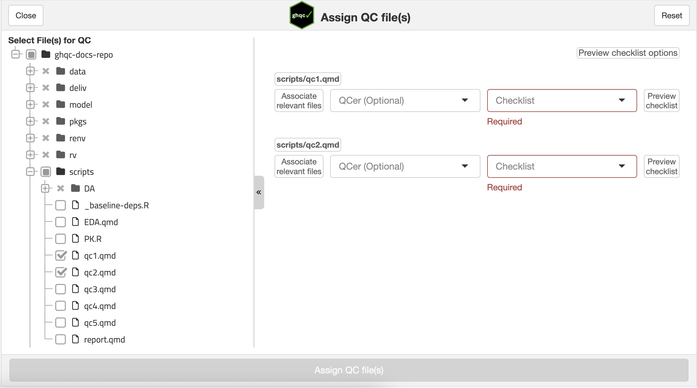

### 4. Configure Files for QC

For each file, you are able to configure 3 options:

<Card title = "Associate Relevant Files" icon = "add-document">
Allows the user to attach relevant files that the QCer may need to reference during QC, 
such as datasets, helper functions, etc.

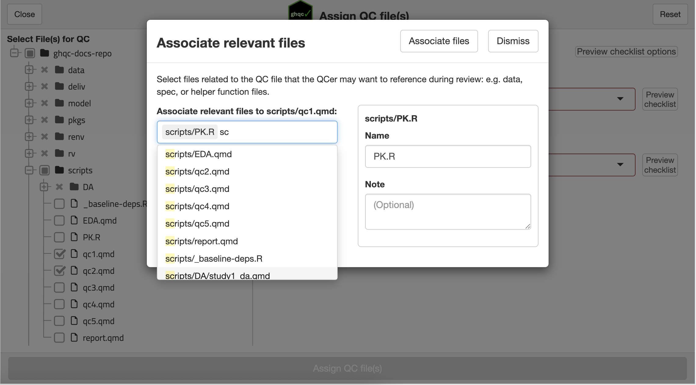
</Card>

<Card title = "Assign QCer" icon = "pen">
A QCer can be picked from a list of users which have the required access to the repository 
or can be assigned to the GitHub Issue later in GitHub.

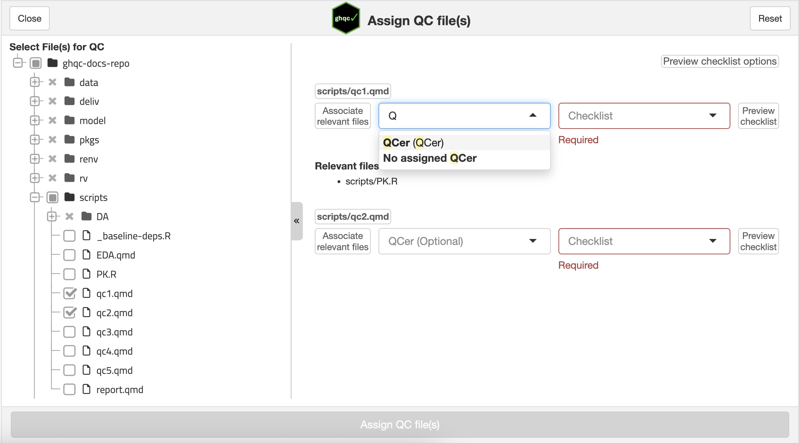
</Card>

<Card title = "Choose a Checklist" icon = "approve-check-circle">
<Badge text="Required" variant="danger" /> 

One customizable checklists must be selected to provide the QCer a list of requirements that should be reviewed for the
file type. 

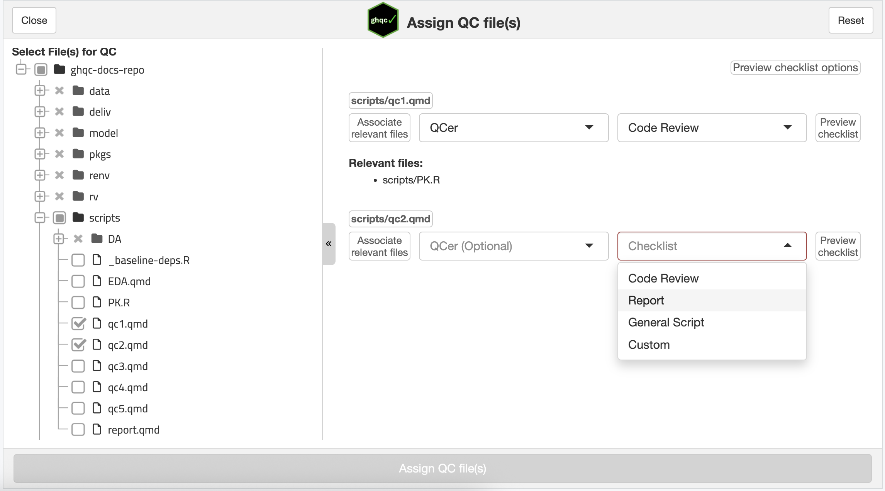
</Card>

### 5. Assign QC File(s)

Once your desired configuration is set-up, with at least each selected file having a checklist, the "Assign QC file(s)" button will activate.
Clicking this button will create the issues within the new milestone.

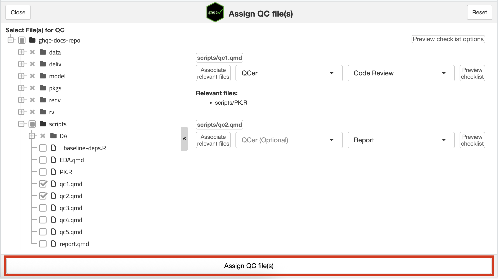

After assigning the files for QC, a pop-up will appear that the QC was successfully initialized with a URL to the created Milestone.

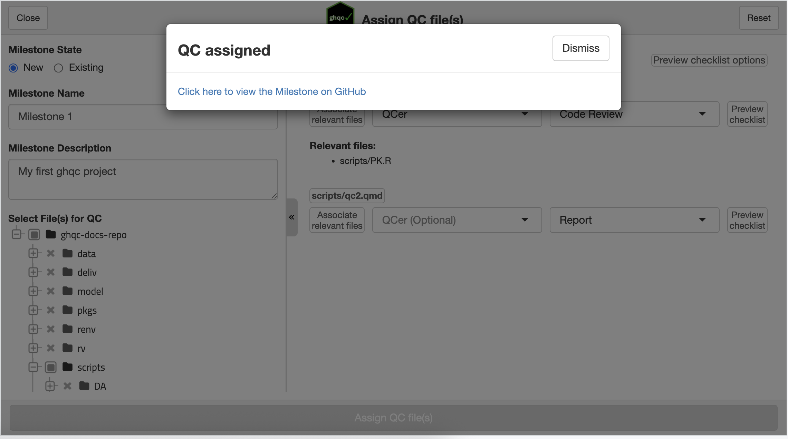

Following the link will bring us to the milestone's landing page on GitHub, allowing us to explore the newly created Issues.

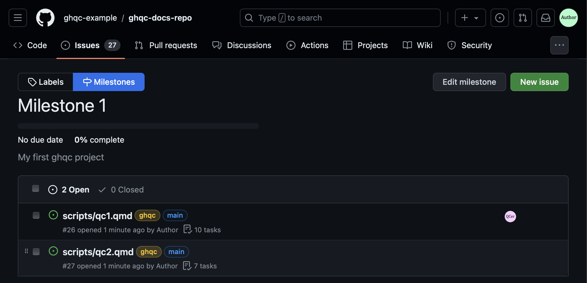

### 6. QC Issue Body

Let's take a moment to familiarize ourselves with the Issue created by ghqc.

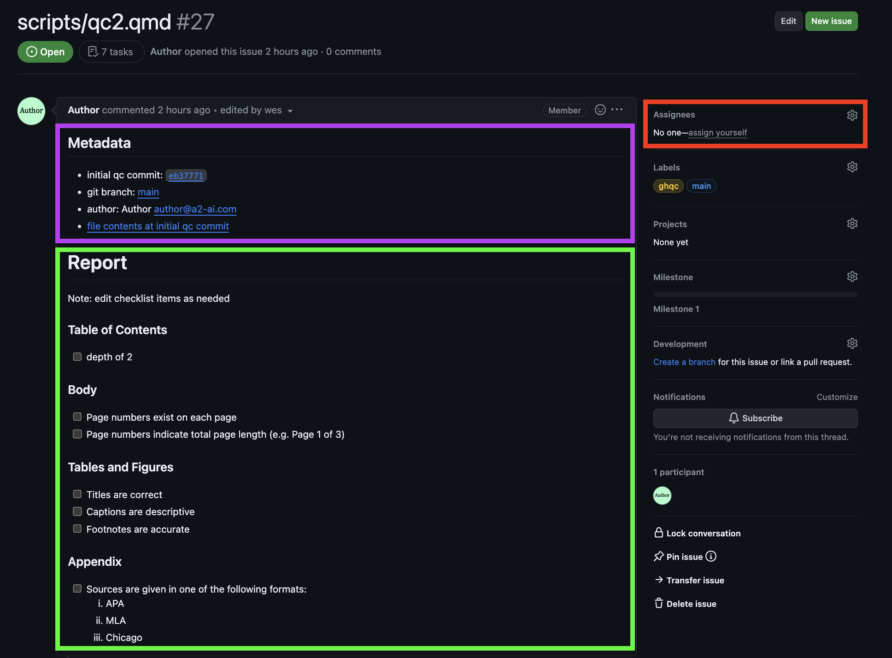

There are 3 components to explore:

<Card title = "Metadata" icon = "document">
`ghqc` provides metadata at the start of each ghqc issue. It includes the commit the issue was initialized at, what branch it was on, the author, 
and a link to the file content at the commit the issue was initialized at. This metadata provides important context to the QCer and to anyone looking
back at a QC in the future.
</Card>

<Card title = "Checklist" icon = "approve-check-circle" >
Next in the Issue body is the review checklist for the QCer. This can be manually edited by the author before the QC begins to provide additional context or items for the reviewer.
</Card>

<Card title = "Assignee" icon = "pen">
Last item to draw your attention to is the assignees box. If a user decides to not assign a QCer when creating the issues, 
they can assign one at any time using the GitHub Assignees box and achieve the same results as using the app.
</Card> 
