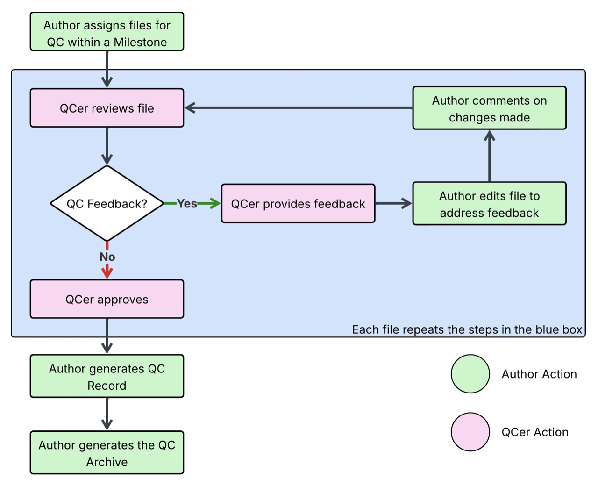

`ghqc` was designed to foster an iterative, communicative, and unobtrusively traceable way of working for authors and reviewers
to collaborate to complete a QC.

On this page, we will discuss the ghqc workflow and the core features.

## Workflow

Files are assigned for QC and grouped within a milestone. Each file is iteratively
reviewed and edited until all parties agree the script has no more changes to be made. Then the QC is approved.
Once all QCs in a milestone are approved, authors can create QC records and/or archive the scripts at their approved state.

## GitHub Issues and Milestones

`ghqc` uses GitHub as the _hub_ for the QC process by utilizing **Issues** and **Milestones** for organization.

### Milestones
Milestones serve as an organizational structure during the project's QC. Milestones group files assigned for QCs under 
common goals or timelines, such as a project.

This organization provides users with a simple, flexible way to progress through the lifetime of a project and provides
a summary of how a QC for the milestone is proceeding.

### Issues
Issues serve as the core unit of the QC. When a file is assigned for QC, an issue is created - titled the name of the file.

GitHub Issues provide features "out of the box" that can directly aid a QC, while `ghqc` adds more for traceability and for the
reviewer to set-up their repository.

#### Default Features
* Assignees - Allows authors to assign a reviewer(s) to their script, or a reviewer to assign themselves, to organize ownership 
of the review.
* Comments - An intuitive way for reviewers and authors to communicate in a traceable way.
* Interactivity - Issues provide an interactive, markdown style comment body which allows reviewers to easily check off review items, 
while giving organizations comfort all actions are traceable.
* Blocking Issues - Relevant files/issues which block the approval of other issues are tracked in newer versions of GitHub.

#### `ghqc`'s Additional Features
At issue creation, and subsequent comments made by `ghqc`, `ghqc` adds additional metadata to the issue/comment body. 
For more detail about what content is specifically added by each comment type, refer to their respective page.

Some example features:
* Commit of interest: When issues/comments are created, the commit of interest is included in the body.
* File content links: Links to the file content in GitHub at the commit of interest
* Checklists: Checklists against which files are reviewed
