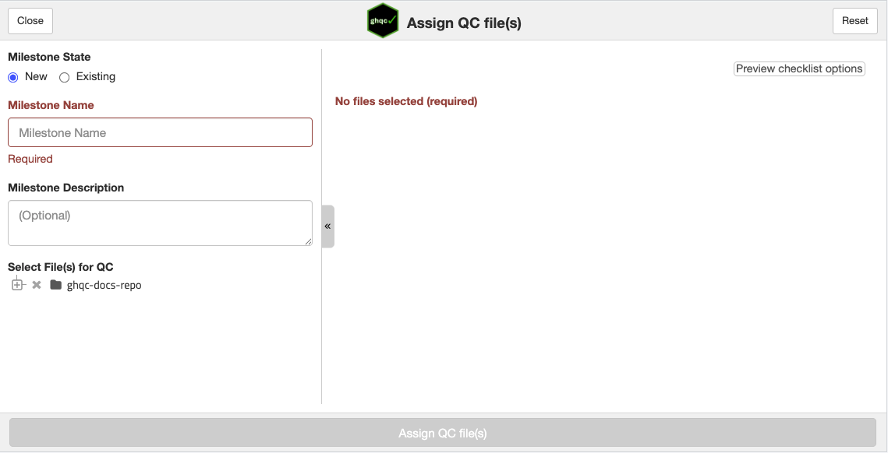
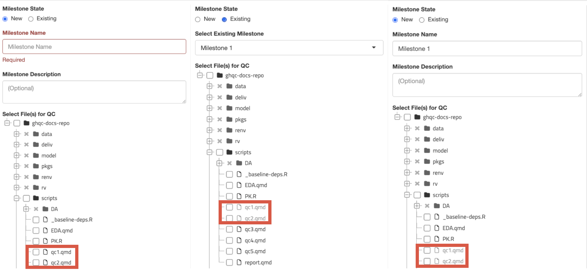
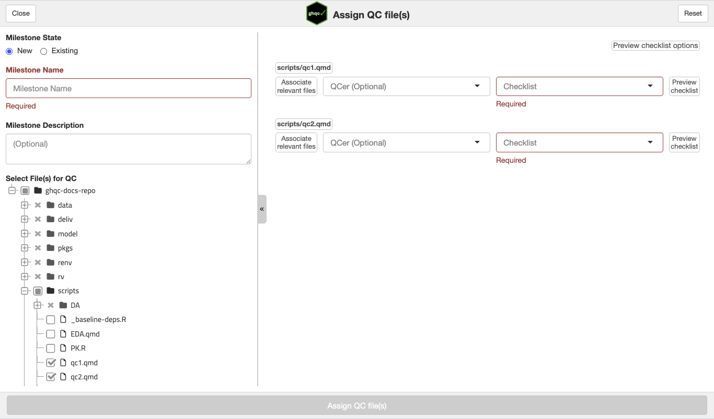
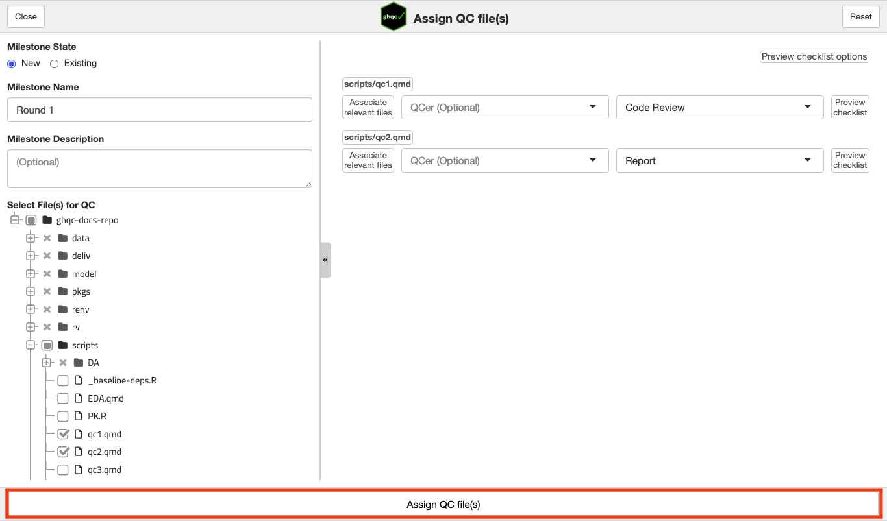
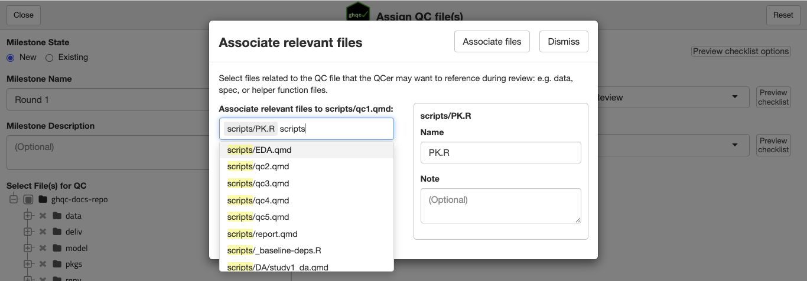
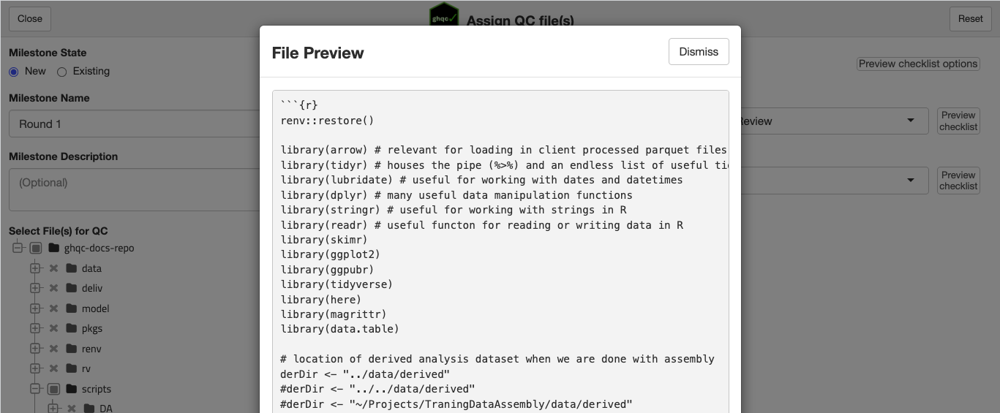
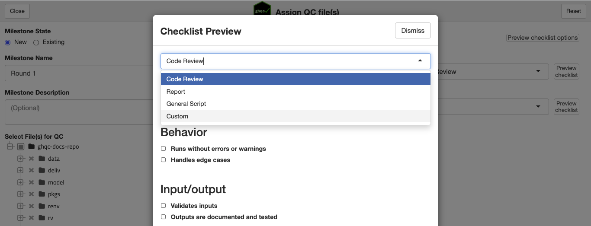
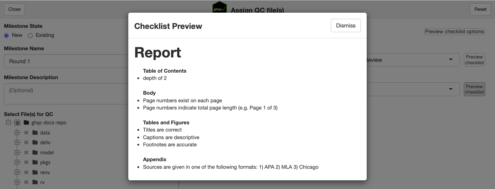
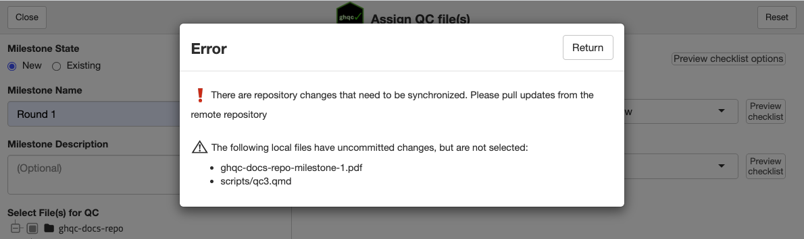

import { LinkCard } from '@astrojs/starlight/components';

The first step in the workflow is to assign files for QC. To do this, we use the **Assign app**.

At its core, the Assign app allows users to:

1. Create a Milestone for which to group files
2. Select the files for which to create issues
3. Select checklists and optionally assign QCers for each file
4. Post the Issues to the GitHub repository

Additionally, the Assign app determines your local *branch*, *commit*, and the file author, which is attached to the issue.

<iframe
    src="/ghqc-docs/file_tree.html"
    style="width: 100%; height: 31vh; border: none;"
>
</iframe>

## Features

The Assign app contains many features which are useful to orient users while using the app.

Below is a screenshot of the app on open. You can see it's similar to the mock UI above, where you are able to provide
a milestone name, description, select files from a file tree, and assign QC files, but it also provides many additional useful features.

<LinkCard 
    title = "How to Launch the Assign App"
    href = "../../intro/initialize/#1-launch-the-assign-app"
    description = ""
/>

### Existing Milestones

The Assign app allows users to create new milestones as well as add new issues to existing milestones.
Within a milestone, `ghqc` enforces that a file can only be assigned to one issue to ensure reviews do not conflict with each other
and all feedback is co-located.

To help make this clear to users assigning new files to be QCed within a milestone, the Assign app will grey out files already
assigned to issues in the milestone.

### Required Values

The Assign app requires a name for a milestone and each selected file have a checklist selected. 

To help make this clear to users and prevent unsupported patterns, the app will make clear to the users what values need to be filled out
AND prevent files from being assigned until all values have inputs.

### Relevant Files

While an Issue is representative of one file, files and scripts rarely live as isolated from the rest of the repository.
Inputs, outputs, helpers are all files that may be helpful context to the QCer.

Therefore, the Assign app allows users to associate relevant files to the central file and include it within the issue.

### Previews

The Assign app provides users with multiple ways to preview different content.

#### File Preview

To preview the content of a file, simply select the file name.

#### Checklist Options

To preview the available checklists, select *Preview checklist options*.

#### Individual Checklist Preview

To preview the selected checklist on a file, select *Preview checklist* next to the checklist dropdown.

### Repository Status Checks 

When the user clicks *Assign QC file(s)* the Assign app will check the status of the repository,
verifying it is up to date with the remote.

* **Remote Commits** - If there are remote commits which have not been pulled locally, the Assign app will *not* allow the user to create the issues.
* **Local Commits** - If there are local commits which have not been pushed to the remote, the Assign app will *not* allow the user to create the issues.
* **Local Changes** - The behavior depends on if the file is selected for QC:
    * **Selected for QC** - The Assign app will *not* allow the user to create the issues.
    * **Not selected for QC** - The Assign app will warn about the local changes, but allow the user to proceed and create the issues.

