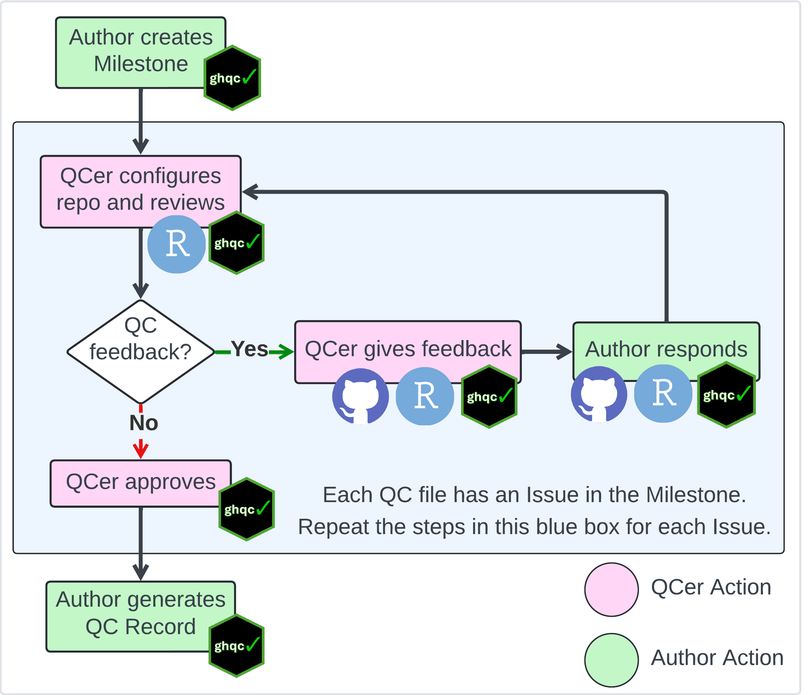

import { Card, CardGrid } from '@astrojs/starlight/components';

The ghqc ecosystem was designed to foster an iterative, communicative way of working for authors and QCers to complete a QC.

In this section, we will detail some of the terminology we utilize and discuss the ghqc ecosystem workflow.

## Terminology

`ghqc` uses GitHub **Issues** and **Milestones** as the *hub* for the QC process. 

### GitHub Issues
Issues serve as the core unit of the QC. When a file is initialized for QC, an issue is created and named after the file.

GitHub Issues provides features "out of the box" that can directly aid a QC:
* **Assignees** - This feature allows authors to assign a reviewer to their script, or a reviewer can assign themselves.
This provides great organizational benefit to show who has ownership of the review.
* **Comments** - This feature provides a intuitive way for reviewers and authors to communicate, 
with the additional benefit of improved traceability.
* **Interactivity** - GitHub Issues provide an interactive, markdown style comment body, which allows reviewers to easily check off
review items, while giving organizations comfort all actions are traceable.
* **Milestones** - This feature allows authors to organize their issues. This will be discussed in further detail below.

In addition to utilizing the features GitHub Issues provide by default, `ghqc` adds additional metadata about the file of interest.
When a file is assigned for QC, a Metadata section is added to the initial body, containing information for the reviewer to set-up 
their repository and for traceability.

<iframe
    src = "/ghqc-docs/issue_body.html"
    style="width: 100%; height: 63vh; border: none;"
>
</iframe>

### GitHub Milestones

Milestones serve as the organizational unit of the QC. Milestones group related issues under common goals or timelines, such a project phase.

This organization provides users with simple, flexible ways to progress through the lifetime of a project. It additionally provides a summary
of how a QC for the milestone is proceeding.

<iframe
    src = "/ghqc-docs/milestone.html"
    style = "width: 100%; height: 36.5vh; border: none;"
>
</iframe>

## Workflow Overview

The ghqc ecosystem uses a 3 phase workflow for each file to be QCed:
1. **Initialize** - A QC is initialized upon the creation of a GitHub Issue through the [`ghqc` assign app](../assign). It contains metadata around the file at 
initialization and checklist items which the QCer should review the file for.
2. **Review** - After initialization, review occurs. `ghqc` promotes an iterative and interactive method by allowing the QCers to comment within the
Issue and the author to reply back with a file difference, highlighting the changes, using the `ghqc` notify app.
3. **Approval** - After the QCer has reviewed the file and has all of their feedback addressed, the Issue can be approved and closed through the `ghqc` status app.

After QC the author can create an exportable record of what occurred within GitHub.

This is visualized below:

On the following pages, we will go into detail of how ghqc aids users to work through the QC workflow, 
starting with how the author creates a milestone populated with issues.

