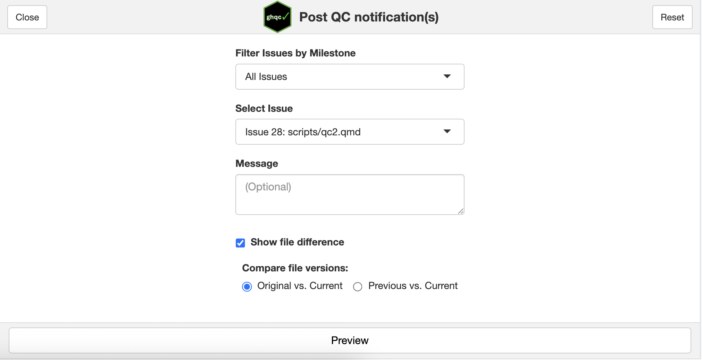
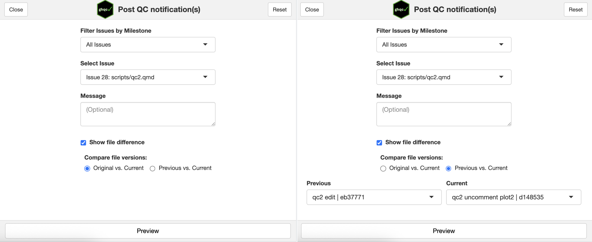
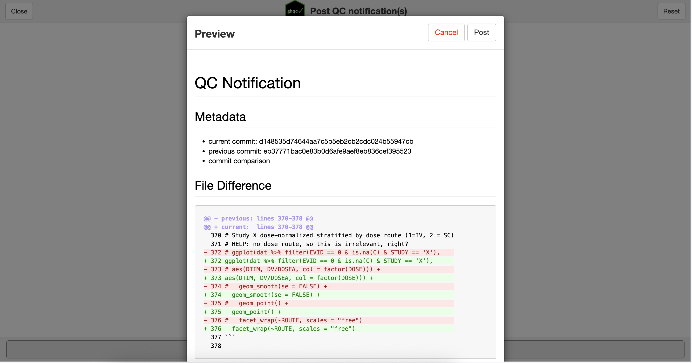

import { LinkCard } from '@astrojs/starlight/components';

After review, or in [some cases](../review/#push-qc-comments) during review, it is necessary to notify members of the QC that the file changed. 
To do this, we use the **Notify app**.

At its care, the Notify app allows users to:
1. Select an existing Issue
2. Select commits for which to comment on
3. Post a comment to the existing Issue

With these commits, a text diff is performed and attached to the issue to draw attention to what has changed in the file.

<iframe
    src = "/ghqc-docs/issue_manager.html"
    style = "width: 100%; height: 30vh; border: none;"
>
</iframe>

## Features

The Notify app contains many features which are useful to orient users while using the app.

Below is a screenshot of the app on open. You can see it is similar to the mock UI above, where you are able to tiler the issues based on milestones,
select issues, and show the file difference, but it also provides many additional useful features.

### Messages

In addition to metadata and a file difference, the Notify app allows users to include a custom message to provide additional context to the notification.

### Compare File Versions

By default, the Notify app will select the current commit and the initial, or *original*, QC commit to compare against. 
The radio button allows users to select any desired commits from a dropdown.

### Preview

The Notify app provides users with the ability to see what the comment will look like before posting it. Clicking the **Preview** button will create a
pop-up with the comment content and options to return or post the comment.

### Repository Status Checks 

Similar to the [Assign app](../assign/#repository-status-checks), the Notify app will only allow you to post comments if your repository is in a compatible state.