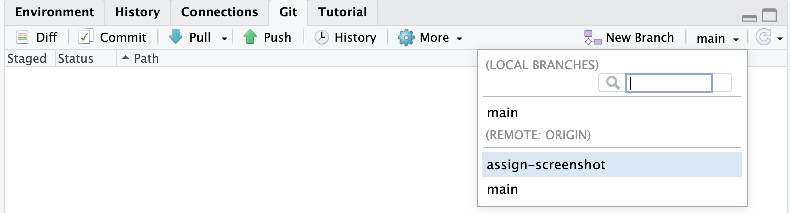
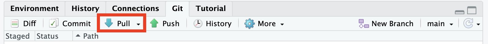

import { Tabs, TabItem, Card } from '@astrojs/starlight/components';

:::note
`ghqc` is under continuous development. Its initial focus was to provide tools for help the QC process be more streamlined and
improve traceability. Tools to help the QCer are under consideration. Feedback on how to improve this process is greatly appreciated!
:::

The second step in the workflow is for the QCer to configure their repository and review.

## Configure Repository

There are two conditions the reviewers repository must meet:

1. The repository is on the correct branch
    <Tabs syncKey="git">
        <TabItem label = "RStudio">
            
        </TabItem>
        <TabItem label = "Terminal">
            ```bash
            git checkout <BRANCH>
            ```
        </TabItem>
    </Tabs>
2. The repository is up to date with the remote
    <Tabs syncKey="git">
        <TabItem label = "RStudio">
            
        </TabItem>
        <TabItem label = "Terminal">
            ```bash
            git pull
            ```
        </TabItem>
    </Tabs>

## Review Tips

### Set Assignee

In some organizations, issues for QC are created before knowing who the reviewers will be.
If you are reviewing a file and are not assigned, we recommend setting yourself as the *Assignee* within the issue.

<iframe
    src = "/ghqc-docs/issue_body_assignable.html"
    style = "width: 100%; height: 25vh; border: none;"
>
</iframe>

### Leave a Comment

One of the primary benefits of using GitHub Issues to track QC is that the reviewer and author can communicate within the Issue. 

QCers can leave comments directly in the issue and include a [permalink](https://docs.github.com/en/repositories/working-with-files/using-files/getting-permanent-links-to-files)
to direct the author to the lines of interest directly.

<iframe
    src = "/ghqc-docs/issue_comment.html"
    style = "width: 100%; height: 65vh; border: none;"
>
</iframe>

### Push QC Comments

QCers have found it beneficial to make edits using newline comments directly within the files, then pushing those changes to the working branch.

Then using the [Notify app](../notify), they are able to highlight diffs and draw attention to the issue.

<iframe
    src = "/ghqc-docs/comment.html"
    style = "width: 100%; height: 56vh; border: none;"
>
</iframe>

:::caution
This option should not be used without discussion within your organization about git policies. 

We are working towards an option similar to this that does not require pushing.
:::